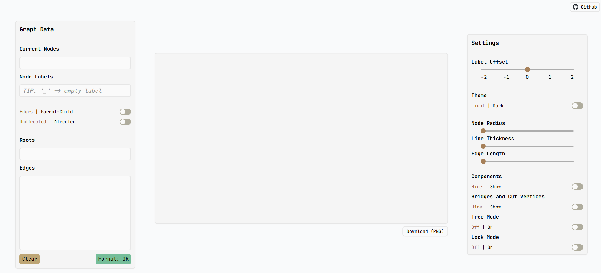
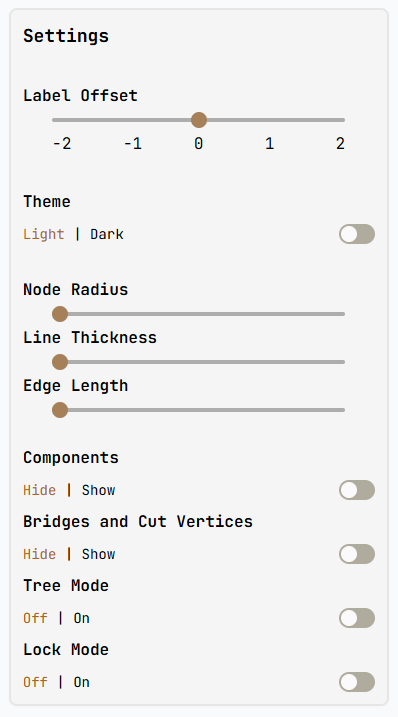
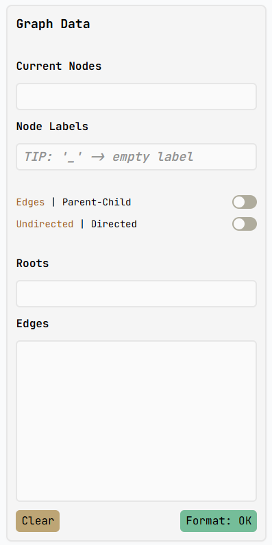
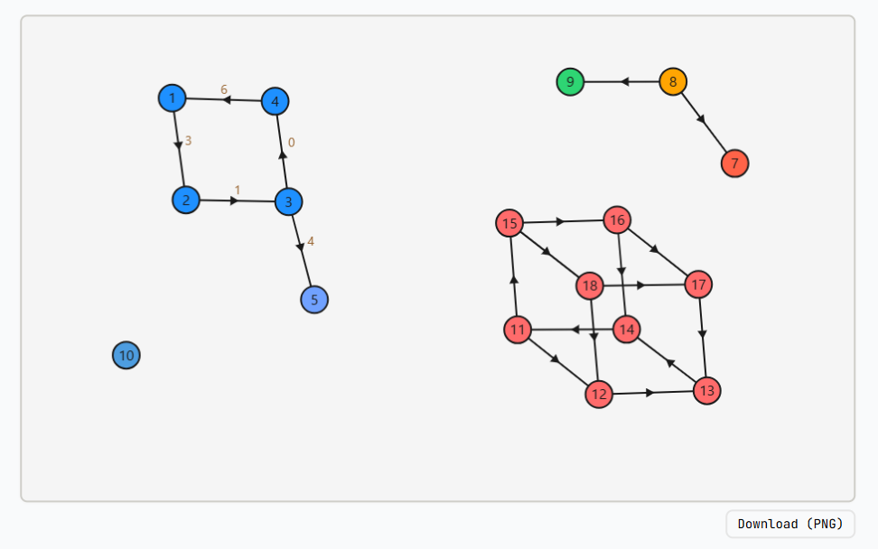
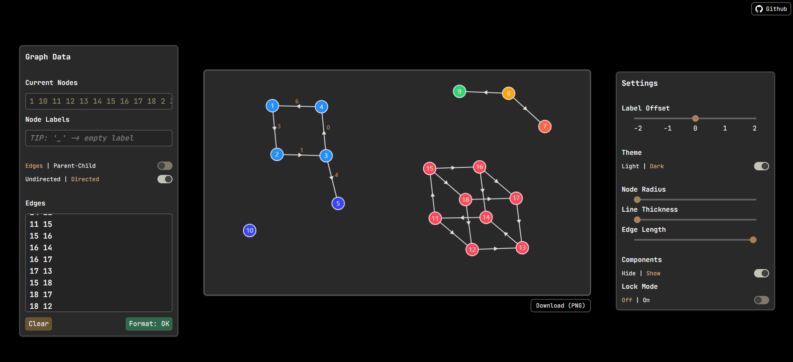

# Lookatthisgraph

**Lookatthisgraph** is a web-based data visualization tool that allows users to create, interact with, and visualize graphs and trees. Designed for ease of use and functionality, it is particularly useful during competitive programming contests. The tool supports the creation of customizable graphs with colored nodes, offering an intuitive interface for users to explore graph theory concepts.



## Table of Contents

- [Features](#features)
- [Installation](#installation)
- [Usage](#usage)
- [Screenshots](#screenshots)
- [Technologies Used](#technologies-used)
- [Contributing](#contributing)

## Features

- **Graph and Tree Creation**: Easily create nodes and edges, and visualize complex data structures.
- **Customizable Node Colors**: Users can change the color of nodes to represent different data attributes.
- **Interactive UI**: Interact with the graphs in real time, enabling a deep exploration of relationships between nodes.
- **Designed for Competitive Programming**: The tool is built to support competitive programmers(Codeforces and Leetcode), helping them visualize and debug graph-related problems during contests.
- **Lightweight and Fast**: Built with modern JavaScript frameworks for a fast and responsive user experience.

## Installation

To run **Lookatthisgraph** locally on your machine, follow these steps:

### Prerequisites

Make sure you have the following installed:

- **Node.js** (v16 or higher)
- **npm** or **yarn**
- A modern web browser

### Steps

1. Clone the repository:

   ```bash
   git clone https://github.com/parthDOOM/Lookatthisgraph.git
   ```

2. Navigate to the project directory:

   ```bash
   cd Lookatthisgraph
   ```

3. Install dependencies:

   ```bash
   npm install
   ```

   or if you prefer yarn:

   ```bash
   yarn install
   ```

4. Start the development server:

   ```bash
   npm run dev
   ```

   or for yarn:

   ```bash
   yarn dev
   ```

5. Open your browser and navigate to:

   ```
   http://localhost:5173
   ```

   The project should now be running on your local machine!

## Usage

- Once the server is running, you can interact with the interface to create new graphs.
- Click on the nodes and edges to modify their properties.
- Use the sidebar to select color schemes and toggle between different visualization modes.
- Export graphs as PNGs for use in presentations or anything for that matter.

## Screenshots

Here are a few examples of how **Lookatthisgraph** works:

- **Graph Creation Interface**

<div align="center">
  
</div>

- **Node Customization**

<div align="center">
  
</div>

- **Example of an Interactive Graph**:
  

  **Dark Mode**
  

## Technologies Used

**Lookatthisgraph** is built using modern web development technologies, including:

- **TypeScript**: For strong typing and scalability.
- **JavaScript**: Core logic of the project.
- **Tailwind CSS**: A utility-first CSS framework for styling.
- **Vite**: A build tool that provides a faster and leaner development experience for modern web projects.

## Contributing

If you'd like to contribute to **Lookatthisgraph**, feel free to fork the repository and submit pull requests. Contributions can include bug fixes, new features, or performance improvements.

### Steps to Contribute

1. Fork the repository.
2. Create a new branch for your feature or bug fix.
3. Submit a pull request, ensuring all tests pass and the code is well-documented.
